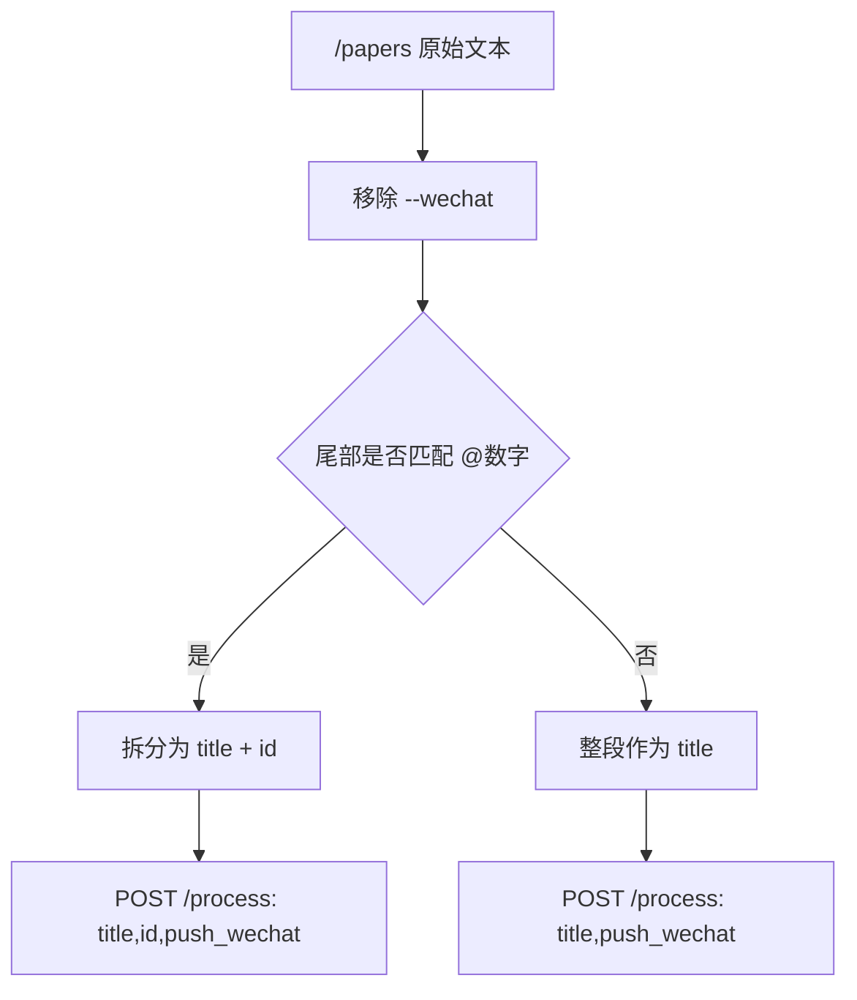

# Telegram 命令兼容 Legacy ID 设计文档
- **Status**: Approved
- **Date**: 2026-04-30

## 1. 目标与背景
为保持 Telegram 命令与命令行 `python main.py --id` 的能力一致，`/papers` 需要支持在标题文本中显式携带 legacy `id`，以便按需触发 LIS-RSS 上传。

本次设计目标：
- Telegram 支持 `标题@123` 形式传入 legacy `id`
- 兼容 `标题 @123` 输入，降低历史使用习惯迁移成本
- 未显式传入 `@id` 时，仍保持纯标题处理
- `--wechat` 行为保持不变

## 2. 详细设计
### 2.1 模块结构
- `telegram-bot/command-parser.ts`：解析标题、legacy `id` 与 `--wechat`
- `telegram-bot/index.ts`：将解析出的 `id` 透传给 `/process` API
- `telegram-bot/command-parser.test.ts`：覆盖新命令格式与异常格式
- `README.md`：同步 Telegram 命令说明
- `api.md`：同步 Telegram 命令与示例

### 2.2 核心逻辑 / 接口
- 输入格式：`/papers <标题[@ID]> [--wechat]`
- 解析顺序：
  - 先识别并移除 `--wechat`
  - 再判断剩余文本是否匹配“尾部 `@数字`”
- 匹配成功时：
  - `title` 为去掉尾部 `@数字` 后的标题文本
  - `id` 为数字部分
- 未匹配时：
  - 整段文本作为标题
  - 不向 API 传 `id`
- Bot 调用 `/process` API 时：
  - 仅在解析到 `id` 时透传 `id`
  - `push_wechat` 保持现有逻辑

### 2.3 可视化图表

## 3. 测试策略
- 解析 `title@123`
- 解析 `title @123`
- 解析 `title@123 --wechat`
- 非法尾缀如 `@abc` 不应被误识别为 `id`
- 只有 `--wechat` 或空标题时返回空结果
