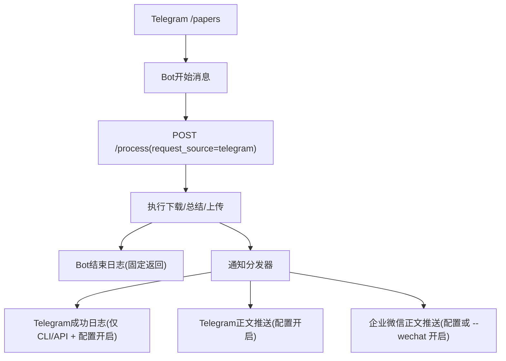

# Telegram 结束日志与正文推送解耦设计文档
- **Status**: Approved
- **Date**: 2026-04-30

## 1. 目标与背景
当前 Telegram `/papers` 命令完成后，Bot 同步回复的处理结果日志与 `PDF_SUMMARY_PUSH_TELEGRAM_LOG` 控制的主动成功日志存在语义重叠，容易在同一聊天里形成重复消息。

本次设计目标：
- Telegram `/papers` 固定返回开始消息与结束日志
- `PDF_SUMMARY_PUSH_TELEGRAM_LOG` 仅作用于 CLI / API 的成功日志主动推送
- `PDF_SUMMARY_PUSH_TELEGRAM_RESULT` 继续统一控制最终摘要正文推送
- Telegram 结束日志展示正文推送状态，但不再展示 `telegram_log` 主动推送状态

## 2. 详细设计
### 2.1 模块结构
- `utils/notifier.py`：通知分发器新增入口级 Telegram 成功日志抑制能力
- `utils/api_queue.py`：透传请求来源，Telegram 场景关闭主动成功日志
- `api.py`：`/process` 请求模型新增 `request_source`
- `telegram-bot/response-formatter.ts`：抽离 Telegram 结束日志格式化逻辑
- `telegram-bot/index.ts`：Telegram Bot 调 API 时声明来源为 `telegram`
- `tests/test_notifier.py`：补充 Telegram 来源下的通知开关测试
- `telegram-bot/response-formatter.test.ts`：补充结束日志文案测试

### 2.2 核心逻辑 / 接口
- API 新增可选字段：
  - `request_source`
  - 默认值为 `api`
  - Telegram Bot 调用时传 `telegram`
- 成功通知策略：
  - `request_source=telegram`：不主动发送 Telegram 成功日志
  - `request_source!=telegram`：按 `PDF_SUMMARY_PUSH_TELEGRAM_LOG` 决定是否主动发送成功日志
  - 所有入口均按 `PDF_SUMMARY_PUSH_TELEGRAM_RESULT` 决定是否主动发送摘要正文
- Telegram Bot 结束日志：
  - 固定返回
  - 展示下载、验证、摘要、上传状态
  - 展示 Telegram / 企业微信正文推送状态
  - 不展示 `telegram_log` 主动推送状态

### 2.3 可视化图表

## 3. 测试策略
- Python：
  - `allow_telegram_log=False` 时抑制成功日志主动推送
  - `PDF_SUMMARY_PUSH_TELEGRAM_RESULT=true` 时仍发送正文
- Telegram Bot：
  - 成功结束日志展示正文推送状态
  - 失败结束日志保留失败原因
  - 类型检查通过
