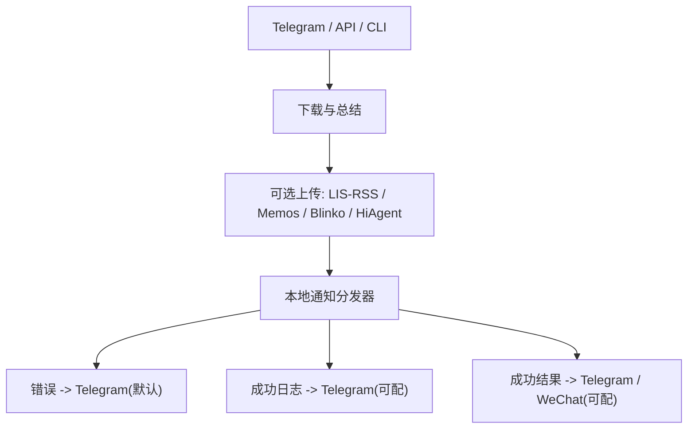

# Telegram 与通知链路独立化设计文档
- **Status**: Approved
- **Date**: 2026-04-30

## 1. 目标与背景
将 Telegram 命令入口和结果通知从主项目中解耦，使本仓库在不依赖主项目通知接口的前提下独立运行。

本次设计目标：
- Telegram `/papers` 不再依赖 `@ID`
- 成功结果按配置推送到 Telegram / 企业微信
- 任一关键失败默认推送 Telegram
- 保留 `id` 作为 API / CLI 的 legacy 可选参数

## 2. 详细设计

### 2.1 模块结构
- `utils/notifier.py`：统一通知分发器，封装 Telegram 主动推送与成功结果分发
- `utils/api_queue.py`：API 直连流程接入通知分发器
- `main.py`：命令行直连流程接入通知分发器，移除主项目通知回调
- `telegram-bot/command-parser.ts`：Telegram 命令解析模块
- `tests/test_notifier.py`：通知分发单测
- `telegram-bot/command-parser.test.ts`：Telegram 命令解析测试

### 2.2 核心逻辑 / 接口
- Telegram 命令格式：`/papers <标题> [--wechat]`
- `@123` 视为普通标题文本，不再解析为 LIS-RSS ID
- `.env` 新增：
  - `TELEGRAM_NOTIFY_CHAT_ID`
  - `PDF_SUMMARY_PUSH_TELEGRAM_LOG`
  - `PDF_SUMMARY_PUSH_TELEGRAM_RESULT`
- 错误通知：
  - 默认尝试推送到 Telegram
  - 未配置 Telegram 时只打印日志，不影响主流程结果
- 成功通知：
  - `PDF_SUMMARY_PUSH_TELEGRAM_LOG` 控制成功日志
  - `PDF_SUMMARY_PUSH_TELEGRAM_RESULT` 控制成功结果正文
  - `PDF_SUMMARY_PUSH_WECHAT` 与 `--wechat` 控制企业微信成功结果

### 2.3 可视化图表

## 3. 测试策略
- Python：
  - 错误消息格式化
  - Telegram 长消息拆分
  - 成功通知开关组合
- Telegram Bot：
  - `/papers 标题`
  - `/papers 标题 --wechat`
  - `/papers 标题 @123` 不再解析 ID
- 验证点：
  - 无主项目通知配置时 API / CLI / Telegram 仍可运行
  - `id` 仍可作为 legacy 参数控制 LIS-RSS 上传
  - `main.py` 不再保留数据库批量模式入口
