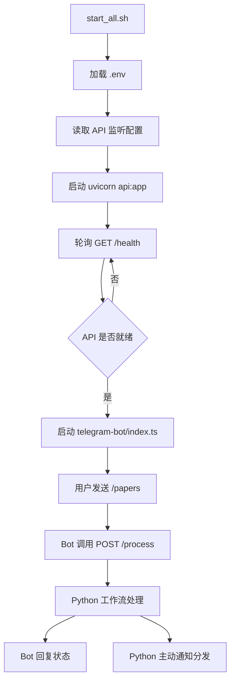

# 统一启动脚本与 API 端口配置 设计文档
- **Status**: Proposal
- **Date**: 2026-04-30

## 1. 目标与背景

当前项目的 Telegram Bot 只是命令入口，实际处理链路依赖本仓库的 `POST /process` API。

现状问题：

- `start_telegram_bot.sh` 只启动 Bot，不启动 API，部署时容易遗漏依赖进程。
- `telegram-bot/index.ts` 默认请求 `http://localhost:8081`，`api.py` 默认监听 `8081`，端口耦合为硬编码约定。
- API 监听地址与 Bot 访问地址语义不同，若直接共用一个 host 配置，容易把 `0.0.0.0` 误用为客户端请求地址。

本次设计目标：

- 提供一个统一启动脚本，确保先启动 API，再启动 Telegram Bot。
- 将 API 监听端口改为可配置。
- 保持现有 `.env` 兼容，避免破坏已部署环境。
- 最小化改动，不引入额外进程管理复杂度。

## 2. 详细设计

### 2.1 模块结构

- `api.py`: 读取环境变量，按可配置 host/port 启动 FastAPI 服务
- `telegram-bot/index.ts`: 解析 Bot 侧 API 访问地址，优先显式 URL，其次按端口拼接本地回环地址
- `start_all.sh`: 统一启动脚本，负责加载 `.env`、拉起 API、健康检查、启动 Bot、退出清理
- `.env.example`: 补充 API host/port 配置说明
- `README.md`: 更新启动顺序与配置说明
- `tests/`: 补充与启动配置相关的最小回归测试

### 2.2 核心配置设计

新增或明确以下环境变量：

- `PDF_SUMMARY_API_BIND_HOST`
  - API 监听地址
  - 默认值：`0.0.0.0`
- `PDF_SUMMARY_API_PORT`
  - API 监听端口
  - 默认值：`8081`
- `TELEGRAM_API_URL`
  - Telegram Bot 调用 API 的完整地址
  - 可选
  - 未配置时，由 Bot 自动回退为 `http://127.0.0.1:${PDF_SUMMARY_API_PORT}`

说明：

- `PDF_SUMMARY_API_BIND_HOST` 只用于服务监听，不直接给 Bot 拼接请求地址。
- Bot 默认访问 `127.0.0.1`，避免误用 `0.0.0.0`。
- 为兼容旧配置，`TELEGRAM_API_URL` 仍保留最高优先级。

配置优先级：

1. 若设置 `TELEGRAM_API_URL`，Bot 直接使用该值
2. 否则使用 `http://127.0.0.1:${PDF_SUMMARY_API_PORT}`
3. 若 `PDF_SUMMARY_API_PORT` 未配置，则回退 `8081`

### 2.3 统一启动脚本设计

脚本职责：

1. 进入项目根目录
2. 校验 `.env` 是否存在
3. `source .env`
4. 校验 `TELEGRAM_BOT_TOKEN`
5. 启动 API 子进程
6. 轮询 `GET /health`，等待 API 就绪
7. API 就绪后启动 Telegram Bot
8. 捕获退出信号，清理 API 子进程

约束：

- 不替代 systemd，只作为本地部署和手工运维的统一入口
- 不负责自动守护重启，保持脚本职责单一
- API 启动失败时，不继续启动 Bot

### 2.4 接口与输入输出

API 启动输入：

- `PDF_SUMMARY_API_BIND_HOST`
- `PDF_SUMMARY_API_PORT`

Bot 调用输入：

- `TELEGRAM_API_URL`
- `PDF_SUMMARY_API_PORT`

统一启动脚本输出：

- 标准输出打印关键阶段日志
- 返回码非 0 表示启动失败

### 2.5 可视化图表

## 3. 测试策略

### 3.1 正常路径

- 未配置新变量时：
  - API 仍监听默认 `0.0.0.0:8081`
  - Bot 仍请求默认 `http://127.0.0.1:8081`
- 配置 `PDF_SUMMARY_API_PORT=8091` 后：
  - API 监听 `8091`
  - Bot 默认改为请求 `http://127.0.0.1:8091`
- API 正常启动后，统一脚本成功拉起 Bot

### 3.2 边界条件

- `.env` 缺失时，统一脚本直接失败并提示
- `TELEGRAM_BOT_TOKEN` 缺失时，统一脚本直接失败并提示
- `PDF_SUMMARY_API_PORT` 非法时，API 启动失败，统一脚本不继续启动 Bot
- `TELEGRAM_API_URL` 显式配置为非默认值时，Bot 必须优先使用该值

### 3.3 异常路径

- API 子进程启动失败，统一脚本返回非 0
- `/health` 超时未就绪，统一脚本终止并清理 API 子进程
- Bot 退出时，统一脚本能同步清理 API 子进程，避免孤儿进程

## 4. 兼容性与迁移

- 现有仅启动 API 或仅启动 Bot 的方式继续保留，不强制迁移
- 现有 `.env` 中仅配置 `TELEGRAM_API_URL=http://localhost:8081` 的部署方式继续兼容
- 新增统一启动脚本后，推荐手工启动统一改为使用单入口脚本

## 5. 风险与取舍

- 不新增“一体化 systemd service”，避免把手工脚本和生产守护策略耦合在一起
- 不移除 `TELEGRAM_API_URL`，避免老环境升级时直接失效
- 不把 API bind host 与 Bot 请求 host 合并为同一个变量，避免部署语义混乱
